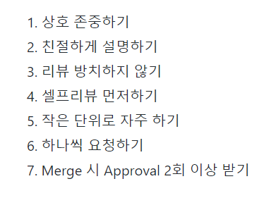
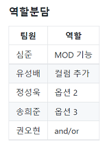
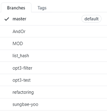
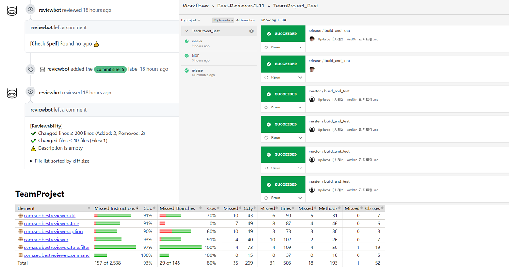
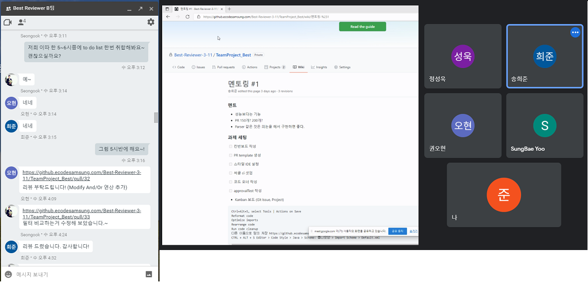
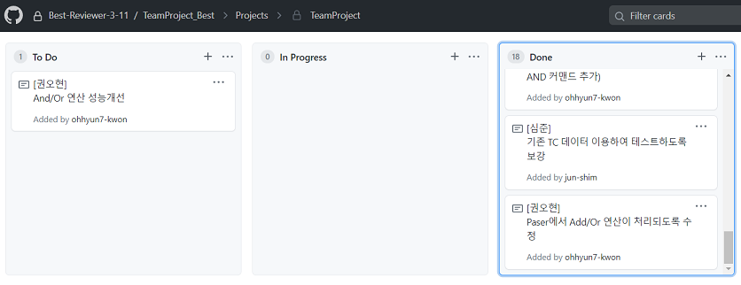

### Coding & Review Ground Rules

핵심가치 : https://github.ecodesamsung.com/Best-Reviewer-3-11/TeamProject_Best/wiki/%ED%95%B5%EC%8B%AC%EA%B0%80%EC%B9%98-(Team-Core-Values)

Team GROUND RULES : https://github.ecodesamsung.com/Best-Reviewer-3-11/TeamProject_Best/wiki/Team-GROUND-RULES

### 협업 방식

- 작업 분배 : 추가 요구 사항 별 분담

- branch 정책 : 개인 개발 브랜치

- 자동화 tool 적용 : review bot, circle ci, jacoco 등 적용

- 온라인 협업 : 사외 환경인 점을 고려하여 google hangout / google meeting 이용

- 현황 공유 : github 내 kanban board 이용

