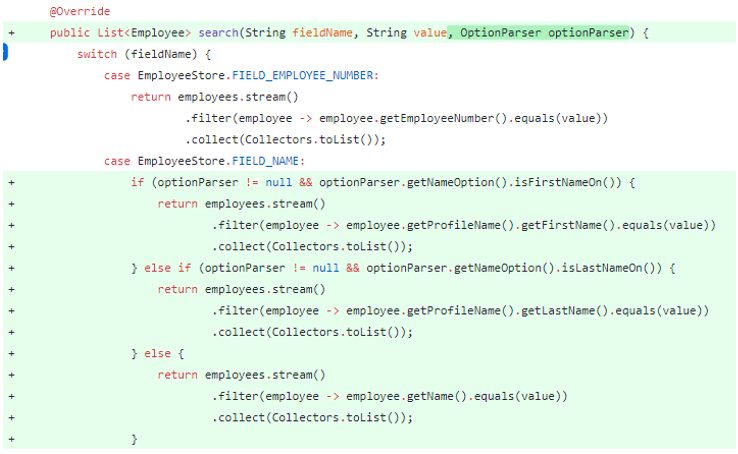
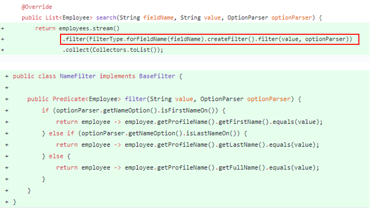
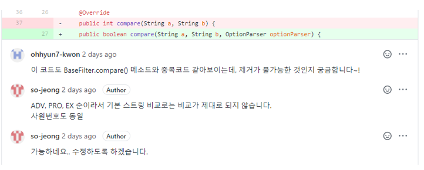
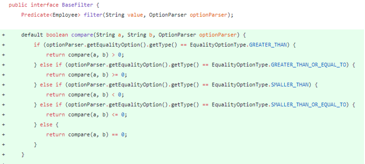

## _**점진적 필터링 로직 개선**_

### _**활동 내역**_

* 옵션2에 대한 요구사항 구현, 하지만 중복코드 다수 발견 및 덩치가 커짐

* 각 필드별 필터링 로직을 추상화 및 팩토리패턴 적용

* 리뷰를 통한 고려하지 못한 부분 발견

* 옵션2에 적용된 추상화로 인해 보다 쉽게 옵션3(비교연산) 적용

 

### _**기대효과**_
추상화를 통한 신규 요구사항에 대한 확장이 쉽고 기능별 역할을 분리되어 SRP원칙을 만족

### _**PRs**_
https://github.ecodesamsung.com/Best-Reviewer-3-11/TeamProject_Best/pull/18
 
https://github.ecodesamsung.com/Best-Reviewer-3-11/TeamProject_Best/pull/20
 
https://github.ecodesamsung.com/Best-Reviewer-3-11/TeamProject_Best/pull/33
 
