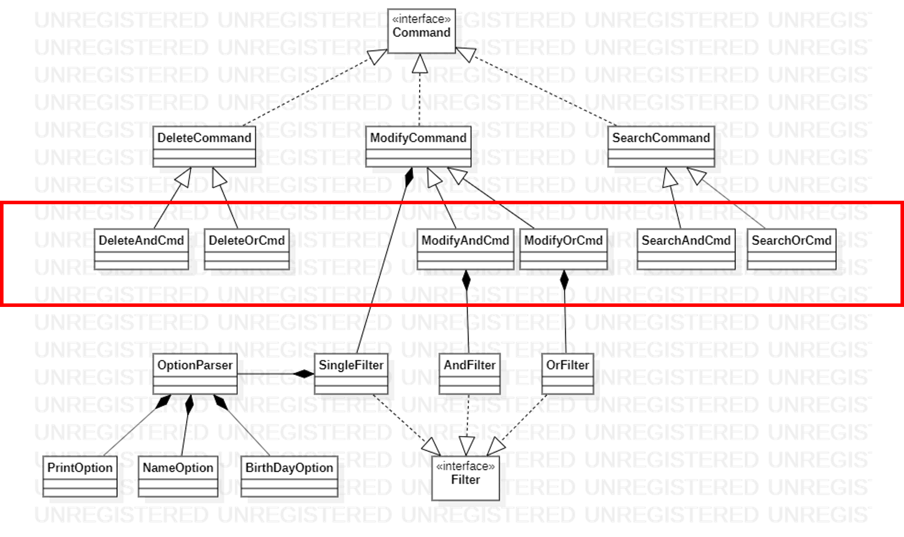

## 현황 및 이슈
  ### 1) 코드분석이 어려움
- And/Or 연산의 책임이 과도하게 분산되어 있고, 상속으로 인해 코드 구조가 장황하여 코드 분석이 번거롭고 불편함
### 2) 확장성 문제
- DEL A and B And C 등 3개 이상의 조건을 만족하는 논리 연산 추가시 커맨드 객체의 조합폭발이 우려됨
- ex) DeleteAndAndCommand, DeleteOrOrCommand, DeleteAndOrCommand, ... 추가 필요

    
### 3) 다양한 코드스멜 확인
- 중복코드 : 각 커맨드에서 And, Or 파싱하는 로직에 중복코드 존재하여 And/Or와 관련된 새로운 기능 추가시 복사 붙여넣기 필요
- 리터럴 문자사용 : 커맨드 클래스에  "-a", -"-o" 등 상수가 직접 노출되어 가독성이 좋지않음
- SRP 위배 : 커맨드 클래스에 옵션을 파싱하는 책임과 커맨드를 수행하는 책임이 공존 

## PR/CL
- 개선 아이디어 리뷰 : https://github.ecodesamsung.com/Best-Reviewer-3-11/TeamProject_Best/pull/45
- 개선 아이디어 적용 : https://github.ecodesamsung.com/Best-Reviewer-3-11/TeamProject_Best/pull/51

## 활동내용
### 1) And Or 기능을 추가할 때, 팀원의 코드리뷰로 개선 아이디어 발굴 (https://github.ecodesamsung.com/Best-Reviewer-3-11/TeamProject_Best/pull/45)

  
  
### 2) 개선 아이디어 적용 (https://github.ecodesamsung.com/Best-Reviewer-3-11/TeamProject_Best/pull/51)
- 과도한 의존성을 제거하여 확장성 개선
    - 커맨드의 구체 클래스에서 구체 Filter (SingleFilter, AndFilter, OrFilter)를 직접 참조하지 않고, Filter 인터페이스를 참조하여 구체 클래스 간 의존성 제거
- 책임 분산(SPR)
    - 커맨드에서 직접 옵션을 파싱하여 Filter를 생성하지 않고, FilterFactory 클래스에 위임하여 옵션을 파싱하여 적절한 Filter를 생성하여 커맨드에 제공

- 중복코드 제거
    - And/Or 연산용 Filter 객체 생성을 FilterFactory 객체로 위임하여 중복된 파싱 코드와 불필요한 AndCommand, OrCommand 클래스 제거
- 리터럴 제거
    - And/Or 연산도 다른 옵션과 동일하게 취급하도록 수정하여 가독성과 유지보수성 확보
  

## 기대효과
- 확장성 개선 : 추후 And/Or 기능 확장 시 Filter를 추가하고, FilterFactory만 수정하면됨
- 유지보수성 개선 : SRP를 만족하여 한 클래스의 수정이 다른 클래스에 영향을 주지 않음. -a, -o옵션을 일반 옵션과 동일하게 취급하여 가독성 개선 

