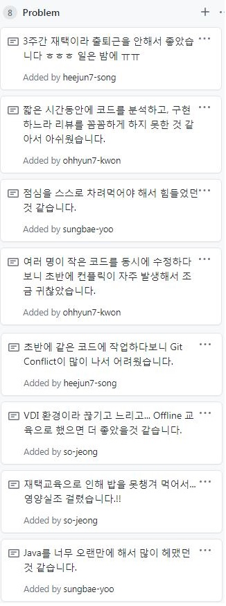
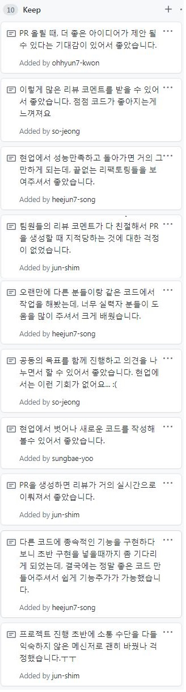
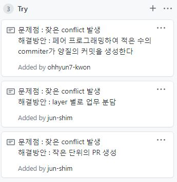

## 회고

### Bad & Problem :-1:

- 재택교육으로 인해, 점심식사가 힘들었음
- Git Conflict가 많이 났음

### Good & Keep :+1:

- 좋은 아이디어 제시가 가능한 분위기
- 리뷰를 통한 코드 품질 개선이 눈에 보임
- 좋은 개발 스킬이 잘 전파될 수 있었음

### Try :muscle:

- Pair programming을 통한 양질의 Commit 생성
- Function 이 아닌 Layer 중심의 업무 할당
- 작은 단위의 Pull Request 

