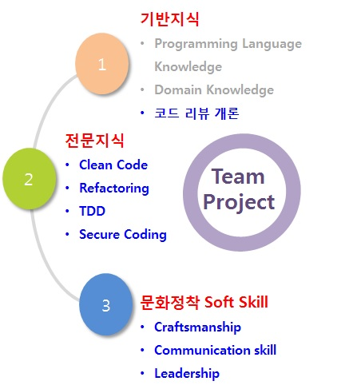
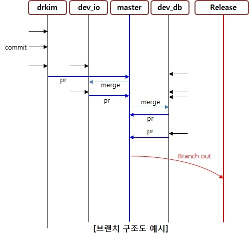

# 팀 프로젝트 개요
- 목적
   - 교육 내용의 주도적 활용 및 팀원간 소통 능력 배양

- 특징
   - 현업 프로젝트와 유사한 개발 방식
   - Clean Code, TDD, Refactoring, Secure Coding 지식을 활용한 요구사항 설계

- 진행방식
   - 1팀 4~5인
   - 팀 내 code review 필수
   

# 일정
- 1 일차
   - 팀 빌딩 및 그라운드 룰 작성
   - Base code 및 요구사항 
   - Base code 분석 및 요구사항 분배

- 2 ~ 4일차
   - 요구사항 구현
   
- 5 일차
   - 팀 프로젝트 회고 및 발표자료 정리
   - 팀별 발표

# 진행 방식
- Organization 내 팀 프로젝트 진행을 위한 Repository 생성
   - Repository : TeamProject_팀명 (팀명은 자유)
   - Description : #팀, 참여 이름 필수( ex:  1팀, 김박사, 김철,  윤박사, 윤영희 )
- Master branch merge 시 Review 필수
   - 개발 branch -> master branch PR & Review
   - Offline review 의 Online 기록을 권장
   - 단, Vote up 의 개수와 같은 세부사항은 팀에서 자율 결정

- TDD Practice 필수
- Release branch 를 만들어 최종 제출
- Commit 별 code change 50 line 이하 권장
   - 여러 개의 commit 을 하나의 PR 로 작성 가능

 
 # 평가 방식
- 요구사항 평가
   - 주어진 요구사항을 모두 만족 해야 함
   - 수행 시간에 따른 점수 차등 부여
 
- S/W 품질 평가
   - Production Code 와 Test Code 의 가독성 및 유지보수성
   - Test Code 의 적절성 및 Code Coverage (95% 이상)
   - Commit & Review 평가
   - Review 의 적절성 (Clean Code, Refactoring, TDD, Secure Coding  측면)
   - Communication Manner
   - Commit 의 규모 및 Test code 동반 여부
 
 - 상세 평가 방법
   - Sample input을 활용한 정확도 확인
   - S/W 품질 평가
     - 전체 코드 Inspection : Class/method 크기, 코드 복잡도, Test code 여부 확인
     - Code Commit 에 대한 정적 평가
     
